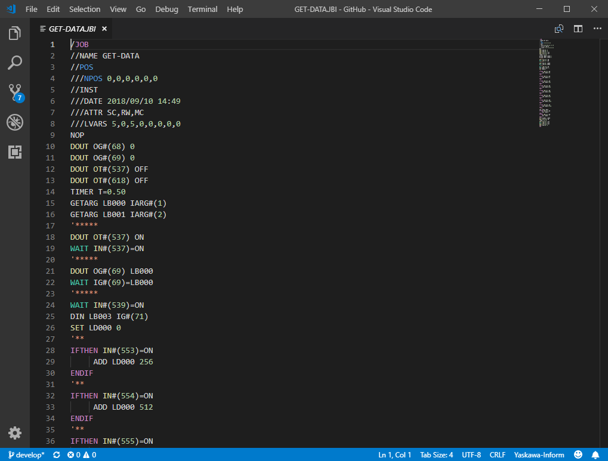
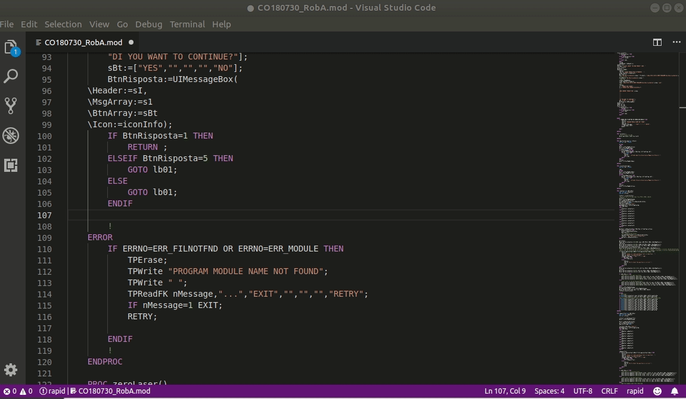

# **Yaskawa** Robot Language support for Visual Studio Code

This is the README for your extension "yaskawa-inform".   
After writing up a brief description, we recommend including the following sections.

---

## Features :

>Syntax highlight in Action ...

>Code completion in Action ...

---
## Known Issues

Calling out known issues can help limit users opening duplicate issues against your extension.

---
## Release Notes

Users appreciate release notes as you update your extension.

[check Changelog for Details on this project](CHANGELOG.md)

## [Unreleased]
- Initial release

--------------------------------------------------------
## ToDo : 

Syntax missing :

- [ ] MUL  | DIV    | ADD       | SUB
- [ ] SETE | NAME   | GROUP?
- [ ] INST | DATE   | ATTR      | LVARS

---

## Working with Markdown

**Note:** You can author your README using Visual Studio Code.  Here are some useful editor keyboard shortcuts:

* Split the editor (`Cmd+\` on macOS or `Ctrl+\` on Windows and Linux)
* Toggle preview (`Shift+CMD+V` on macOS or `Shift+Ctrl+V` on Windows and Linux)
* Press `Ctrl+Space` (Windows, Linux) or `Cmd+Space` (macOS) to see a list of Markdown snippets

### For more information

* [Visual Studio Code's Markdown Support](http://code.visualstudio.com/docs/languages/markdown)
* [Markdown Syntax Reference](https://help.github.com/articles/markdown-basics/)

**Enjoy!**
